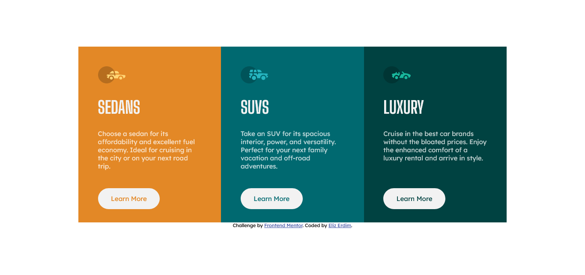

# Frontend Mentor - 3-column preview card component solution

This is a solution to the [3-column preview card component challenge on Frontend Mentor](https://www.frontendmentor.io/challenges/3column-preview-card-component-pH92eAR2-).

## Table of contents

- [Overview](#overview)
  - [The challenge](#the-challenge)
  - [Screenshot](#screenshot)
  - [Links](#links)
- [My process](#my-process)
  - [Built with](#built-with)
  - [What I learned](#what-i-learned)
  - [Continued development](#continued-development)
  - [Useful resources](#useful-resources)

## Overview

### The challenge

Users should be able to:

- View the optimal layout depending on their device's screen size
- See hover and active states for interactive elements

### Screenshot



### Links

- [View Code](https://github.com/elizerdim/3-column-preview-card-component)
- [Live Preview](https://elizerdim.github.io/3-column-preview-card-component/)

## My process

### Built with

- Semantic HTML5 markup
- CSS custom properties
- Flexbox
- Mobile-first workflow

### What I learned

- I realized that adding borders to the buttons for hover effect shifts the entire layout, creating a dizzying effect. I researched the differences between border and outline properties and discovered that outline does not affect the size of the elements, similar to box-shadow. I also wrapped the buttons in a span element and hid its overflow to make sure the tap highlight in touch screens conforms to the rounded corners of the buttons. The code is as follows and the video is linked in the Useful resources section.

```css
.car-type span {
    display: inline-block;
    overflow: hidden;
    border-radius: 2em;
    margin-top: 2em;
}

.car-type a:active {
    ...
    outline: 2px solid var(--very-light-gray);
    outline-offset: -2px;
    ...
}
```

- I decided to add a small animation to the car icons. I used translateX() CSS function and added the hover selector to the svg element to make sure the animation occurs when the mouse is hovered over any part of the icon rather than only on the car. I also added some extra width to the svg so that the cars don't disappear when they move. 

```css
.car-type svg {
    width: 75px;
}

...

.car-type svg:hover path {
    transform: translateX(10px);
    transition: .5s linear;
}
```

### Continued development

- I'd like to learn more about working with SVGs and create more advanced animations in future projects.

### Useful resources

- [CSS Outline vs. Border](https://www.youtube.com/watch?v=xx_pJ2ouGnc) - Very useful video about the differences between border and outline properties and their use cases.
- [How to affect another element when an element is hovered](https://stackoverflow.com/questions/4502633/how-to-affect-other-elements-when-one-element-is-hovered) - This stackoverflow entry helped me figure out how to add animation to a child of an element when the mouse is hovered over any part of the parent element.
- [Scaling SVGs](https://css-tricks.com/scale-svg/) - In depth article about scaling SVGs.